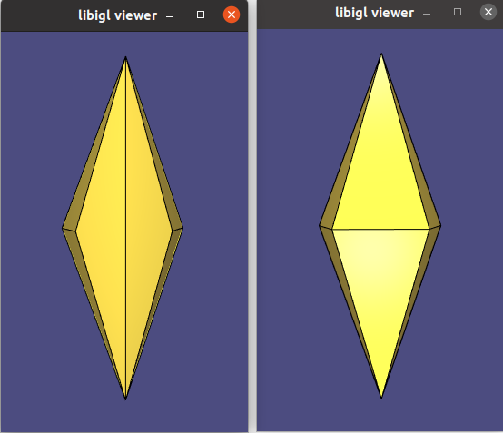
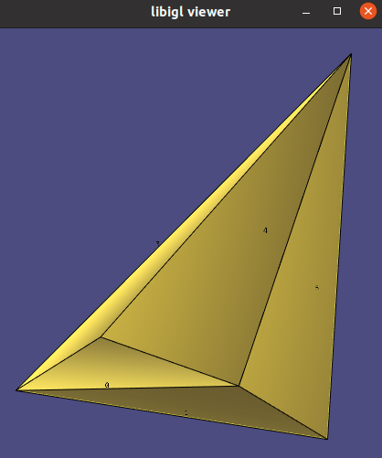

# A Laplacian for Nonmanifold Triangle Meshes
Reimplementation of research paper in libigl-style.  

## Reference
Sharp, N., & Crane, K. (2020, August). A Laplacian for Nonmanifold Triangle Meshes. In *Computer Graphics Forum* (Vol. 39, No. 5, pp. 69-80).

## How to run
1. Download libigl library
1. `mkdir build`
1. `cd build`
1. `cmake ..`
1. `make`
1. `./laplacian_for_nonmanifold [../data/nonmanifold.off]`

The common way to compute Laplacian for triangle meshes is cotan-Laplacian, but it does not yield a maximum principle. The remedy of this is intrinsic Delaunay triangulation (iDT), and it should satisfy the following condition. For every interior edge, a + b <= 180 degree where a and b are the opposite angles in the two incidient triangles of the edge. This can be met by applying intrinsic edge flips on non-Delaunay edges.  

  

 input manifold mesh (left), and intrinsic Delaunay triangulation (right) 

The limitation of iDT is that input meshes must be edge-manifold meshes. In other words, every interior edge must be in exactly two triangles. For a nonmanifold mesh, one can create a tufted cover and convert it to a edge-manifold mesh: each triangle face is replaced with two logical copies, front and back triangles, and every edge is glued to exactly two of them.

  

 input nonmanifold mesh (left), and tufted cover (right) 

In the left mesh of the above figure, one edge, say ij, is contained in three triangles, say triangle 0, 1, and 2. In its tufted cover, a triangle 3, 4, or 5 is a back face of a triangle 0, 1, or 2 respectively. Then, the edge ij is glued to exactly two triangles (0,4) or (1,5) or (2,3). The three ij edges are considered separately and can be flipped individually. 

The boundary edges are glued to its front and back triangles. Hence, a tufted cover is a closed edge-manifold mesh. iDT cannot be applied to a boundary edge although it has an obtuse opposite angle. Such boundary edges become interior in a tufted cover, and therefore, they can be flipped as well.

  

 intrinsic Delaunay triangulation on a tufted cover 

Once iDT is performed on a tufted cover, cotan-Laplacian and its associated mass matrix are computed on the output mesh. Since the number of faces are doubled, the Laplacian and the mass matrices are multiplied by 0.5 in the end.
